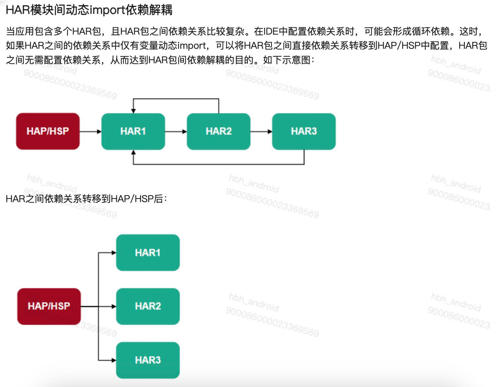
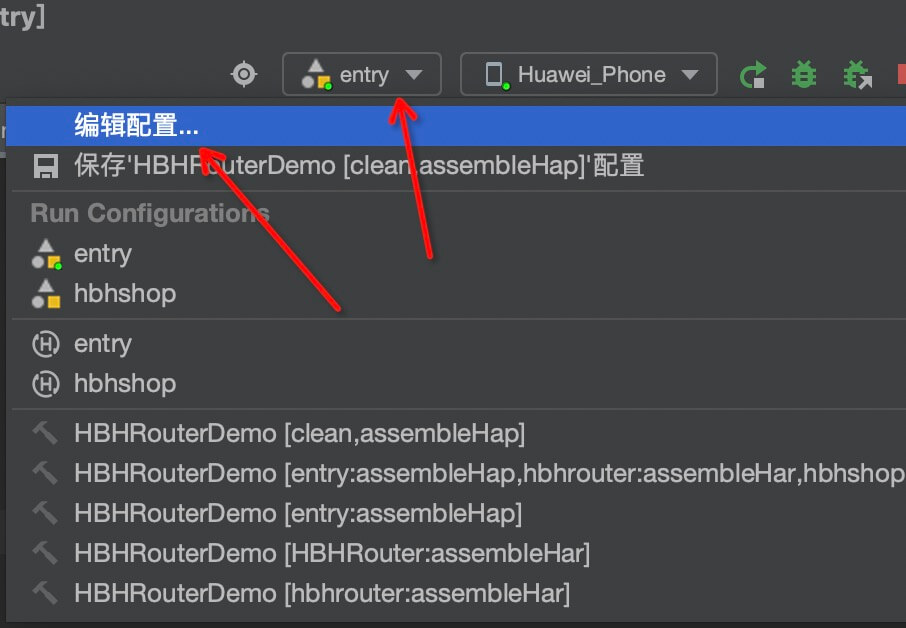
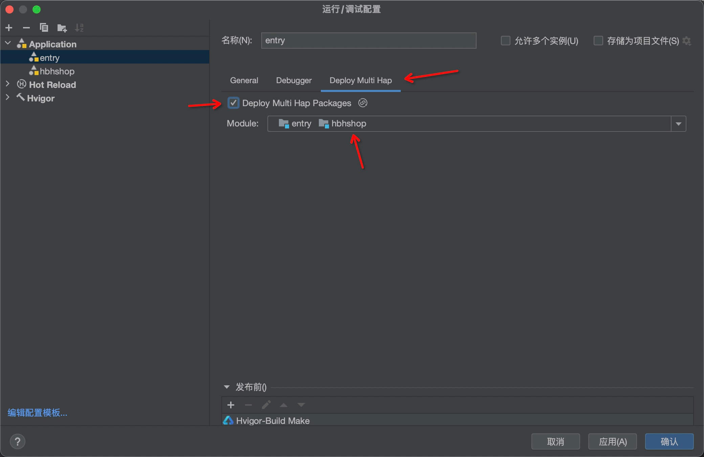

# 鸿蒙开发URL动态路由

## 场景

之前在 iOS 或者 Android 开发的时候，我们有一套统一的 URL 规范，通过 URL 路径可以跳转到不同的App原生页面。iOS 类似 MGJRouter，Android 类似 ARouter。

主要场景就是可以通过 CMS 后台配置路径，在App内所有的资源位可以跳转到 App 的任何页面；当然也可以在开发中直接通过 URL的方式跳转。<br>

如在App的首页Banner，需要跳转到某个商品详情页面，iOS/Android 的统一路径为：

```swift
hbh://mall/store/detail?id=88888
```

hbh 为 App 自定义的`URL Scheme`。

所以在鸿蒙 HarmoneyOS Next 开发中，我们需要继续沿用这套规范，通过 URL 跳转到不同的页面，且要保证 iOS、Andorid、HarmoneyOS Next 的跳转规则一致。

现在大多数的App都是使用组件化开发，如果两个业务组件需要相互跳转到对应组件模块的页面，就需要相互引用组件，这样就会造成<b>依赖循环引用</b>的问题。

所以，为了规范跳转和引用规则和避免造成循环引用的问题，在页面跳转的时候，我们尽量直接通过路由组件的方式跳转，模块库直接尽量减少相互依赖，业务模块也全部依赖 Router 组件即可。<br>

下面是官网介绍动态`import`时的一个依赖示意图结构图，可以参考：



## 项目结构

首先，要确定项目依赖结构，鸿蒙 App 的项目结构一般为：HAP(主 App) 依赖 HSP(动态库) 或 HAR(静态库)。

| 模块 | 描述 | 场景  |
| ---- | ----- | ----- |
| <b>HAP</b>  | HAP（Harmony Ability Package）是应用安装和运行的基本单元。HAP 包是由代码、资源、第三方库、配置文件等打包生成的模块包，其主要分为两种类型：entry 和 feature。                                                                                                             | <b> 单 HAP 场景 </b> ：如果只包含 UIAbility 组件，无需使用 ExtensionAbility 组件，优先采用单 HAP（即一个 entry 包）来实现应用开发。虽然一个 HAP 中可以包含一个或多个 UIAbility 组件，为了避免不必要的资源加载，推荐采用“一个 UIAbility+多个页面”的方式。<p> <b>多 HAP 场景</b> ：如果应用的功能比较复杂，需要使用 ExtensionAbility 组件，可以采用多 HAP（即一个 entry 包+多个 feature 包）来实现应用开发，每个 HAP 中包含一个 UIAbility 组件或者一个 ExtensionAbility 组件。在这种场景下，可能会存在多个 HAP 引用相同的库文件，导致重复打包的问题。<p>|
| <b>HAR</b>  | HSP（Harmony Shared Package）是动态共享包，可以包含代码、C++库、资源和配置文件，通过 HSP 可以实现应用内的代码和资源的共享。HSP 不支持独立发布，而是跟随其宿主应用的 APP 包一起发布，与宿主应用同进程，具有相同的包名和生命周期。<br>仅支持应用内 HSP，不支持应用间 HSP。<p> | 多个 HAP/HSP 共用的代码和资源放在同一个 HSP 中，可以提高代码、资源的可重用性和可维护性，同时编译打包时也只保留一份 HSP 代码和资源，能够有效控制应用包大小。<br>HSP 在运行时按需加载，有助于提升应用性能。<p> |
| <b>HSP</b>  | HAR（Harmony Archive）是静态共享包，可以包含代码、C++库、资源和配置文件。通过 HAR 可以实现多个模块或多个工程共享 ArkUI 组件、资源等相关代码。<p>| 作为二方库，发布到 OHPM 私仓，供公司内部其他应用使用。作为三方库，发布到 OHPM 中心仓，供其他应用使用。<p>|

一般我们的业务模块为创建为 HSP 动态库模式，也是官网建议的模式，主要是可以缩减包体积大小。

## 设计步骤

### 创建 Router 组件

因为 Router 为基础组建，需要发布到私有仓库或公共仓库，提供给其他组件依赖，这里我们创建为 HAR 静态库。

1. 创建 Router 组件
   创建静态组件 `hbhrouter`, 创建模块时，选择 `Static Library`.
2. 创建管理类
   在组件创建管理类`HBHRouter`，组件内部跳转直接使用[官网Router](https://developer.huawei.com/consumer/cn/doc/harmonyos-guides-V2/arkts-routing-0000001503325125-V2)跳转，使用`Url`库对URL进行解析。<br>
   这里举例App自定义`URL Scheme` 为：`hbh://`，如果遇到 `http`协议，直接打开浏览器即可！<br>
   路由的参数类型我们定义为：`Record<string, string>`类型。<br>
   代码如下：

```typescript
import Url from "@ohos.url"; // URL解析
import { router } from "@kit.ArkUI"; // 路由

// Router管理类
export class HBHRouter {
  // 打开某个链接
  public static openUrl(urlString: string): void {
    if (urlString.startsWith("http")) {
      // 如果是网页，直接打开webView
      // ... 代码省略
    } else if (urlString.startsWith("hbh")) {
      // 如果是自定义hbh地址，解析URI参数和路径
      const url = Url.URL.parseURL(urlString);
      // 路径
      const path = url.hostname + url.pathname;
      // Router参数类型为Record<string, string>
      let params: Record<string, string> = {};
      if (path) {
        // 解析 uri参数
        url.params.forEach((value, key) => {
          params[key] = value;
        });

        // 如果设置过映射
        router.pushNamedRoute(
          {
            name: path,
            params: params,
          },
          router.RouterMode.Standard,
          (err) => {
            if (err) {
              // 如果跳转失败，再跳转到未找到页面
              HBHRouter.pushNotFoundPage();
            }
          }
        );
      } else {
        // 否则跳转到未找到页面
        // ... 代码省略
      }
    }
  }
}
```

接着需要在`hbhrouter`组件根目录的`Index.ets`文件对外暴露接口即可：
```typescript
export { HBHRouter } from './src/main/ets/components/utils/HBHRouter'
```

到此，组件代码就全部完成！

### 创建业务组件
1. 创建业务组件
   比如我们需要一个商城组件，业务组件我们一般采用 HSP 动态库模式，创建一个`hbhshop`组件，创建模块时，选择 `Shared Library`.

2. 创建店铺详情页面
   在pages目录下创建`ShopDetailPage.ets`文件，代码如下：
```typescript
import router from '@ohos.router';

// 申明页面入口时，添加路由名称，名称和路径定义保持一致即可
@Entry({routeName: "mall/store/detail"})
@Component
export struct StoreDetailPage {

  // 接收Router参数
  @State storeId: string = (router.getParams() as Record<string, string>).storeId;
  // 或
  // @State storeId: string = (router.getParams() as Record<string, string>)['storeId'];

  build() {
    Row() {
      Column() {
        Text(`这是 hbhshop 组件模块`)
          .fontSize(30)
          .fontWeight(FontWeight.Bold)

        Text(`来到了storeId为${this.storeId}的店铺`)
          .fontSize(20)
          .fontWeight(FontWeight.Regular)
          .margin({ top:15 })
      }
      .width('100%')
    }
    .height('100%')
  }
}
```
router路径定义时，使用: `@Entry({routeName: "router_page"})`的`routerName`参数进行定义;<br>
参数接收使用：`(router.getParams() as Record<string, string>)`<br>
同样在`hbhshop`组件根目录的`Index.ets`对外暴露接口即可：
```typescript
export { StoreDetailPage } from './src/main/ets/components/pages/ShopDetailPage'
```
或
```typescript
import './src/main/ets/pages/StoreDetailPage'
```
业务组件配置完成！

### HAP 主项目中跳转测试
1. 添加依赖
   在`HAP`主项目`entry`模块中，`oh-package.json5`添加依赖：
```json5
"dependencies": {
    'hbhshop': "file:../hbhshop",
    'hbhrouter': "file:../hbhrouter"
  }
```
因为 hbhrouter静态库还没有发布到远程仓库，这里我们直接依赖本地组件。<br>

2. 引入组件页面
   需要在跳转页面前，提前引入模块到当前组件，比如我们在`entry`主模块要跳转到`hbhshop`组件的`ShopDetailPage`页面，那么在跳转之前需要：
```typescript
import 'hbhshop'
```
如果场景是动态配置的，不知道在什么时机引入合适，可以直接写到App的模块入口`EntryAbility.ets`中，只要保证跳转之前引用过模块即可！

3. 跳转测试
   我们在Demo `page` 目录下自带的`index.ets`页面中添加测试代码：
```typescript
// 导入Router
import { HBHRouter } from 'hbhrouter'
@Entry
@Component
struct Index {
  @State message: string = 'Hello World';

  build() {
    Row() {
      Column() {
        Text(this.message)
          .fontSize(30)
          .fontWeight(FontWeight.Bold)
      }
      .width('100%')

      Button("跳转到店铺详情")
        .onClick(()=> {
          const url = 'hbh://mall/store/detail?storeId=88888'
          // 通过Router跳转
          HBHRouter.openUrl(url)
        })
    }
    .height('100%')
  }
}
```

这里需要注意的是，如果引用动态库，需要 编辑 `Run Configuration`，添加动态库 `hbhshop` 依赖，如下图：



最后看一下运行效果展示：


同样如果其他业务组件需要相互跳转，和上面主项目`entry`模块保持一样的配置即可！<p>
这里需要注意的是，业务组件之间不需要相互依赖，业务组件只依赖 `hbhrouter`，对于业务组件的依赖和引入，全部放到`HAP`主项目 `entry`模块中。

## Demo示例
github：https://github.com/GaoGuohao/HBHRouterDemo

